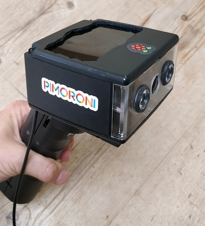

# Night-Vision
A touch screen Night Vision camera written in Python

Final hardware features:
* See in the dark (2m to 5m)
* 4inch LCD touch screen
* GUI controls
* 10 button control with various preview times
* Handy titling handle 
* Swivel head so camera can be moved to the optimum viewing angle.
* Capture real time video saved to the camera
* Capture images and stills

The Night Vision combines an IR camera (infrared, which enables you to take photos and videos in the dark)  The program can be used with a normal camera board but will not have the 'night vision' properties.

# Install software

sudo pip3 install guizero

# The GUI consists of the following 10 buttons and features:
1.	A 10 second preview
2.	A 30 second preview
3.	A 60 second preview
4.	5 minute preview
5.	10 minute preview
6.	15 minute preview
7.	Take a photo
8.	Capture a 10s video clip
9.	Turn on the preview (no time limit)
10.	Close the Night Vision GUI and shut down
